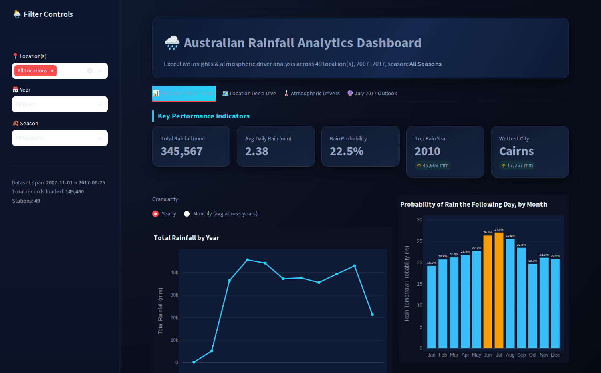
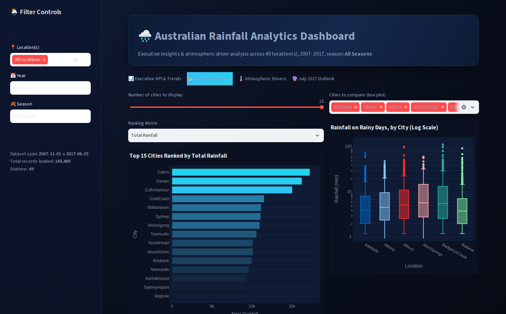
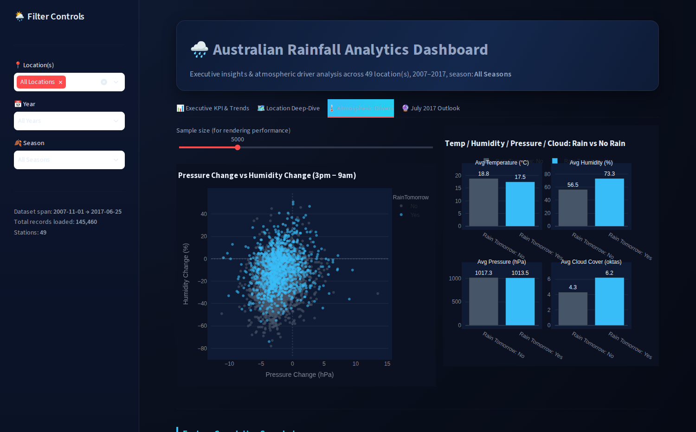
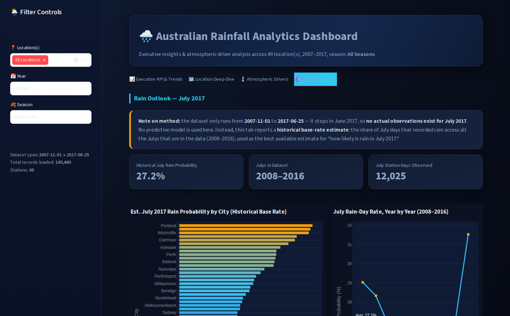

# Australian Rainfall Analytics Dashboard

**🔗 Live dashboard:** [raininaustraliadatacleaning.streamlit.app](https://raininaustraliadatacleaning.streamlit.app/)

An interactive Streamlit + Plotly dashboard built on the engineered
`weathercleaned.csv` dataset (Bureau of Meteorology data, cleaned/feature
engineered in `Rain_in_Australia.ipynb`).

## What's included

| File | Purpose |
|---|---|
| `app.py` | The full Streamlit dashboard |
| `weathercleaned.csv` | The cleaned dataset the app reads |
| `requirements.txt` | Python dependencies |
| `Rain_in_Australia_FIXED.ipynb` | The cleaning/EDA notebook, with a corrected Summary section (see [Notebook correction](#notebook-correction)) |
| `screenshots/` | Preview images of each dashboard tab (used below) |

## Dashboard structure

| Tab | Charts | What it covers |
|---|---|---|
| 📊 Executive KPI & Trends | Total Rainfall by Year *or* Average Daily Rainfall by Month (toggle) · Probability of Rain the Following Day, by Month | Headline KPIs (total/avg rainfall, rain probability, top rain year, wettest city) plus the overall seasonal shape of rainfall and next-day rain risk |
| 🗺️ Location Deep-Dive | Top N Cities Ranked by [Total Rainfall / Avg Daily Rainfall / Rain Probability %] · Rainfall on Rainy Days by City (log-scale boxplot) · City-level summary table | Ranks and compares cities against each other on rainfall volume and rain-day intensity |
| 🌡️ Atmospheric Drivers | Pressure Change vs Humidity Change (scatter) · Temp / Humidity / Pressure / Cloud: Rain vs No Rain (small-multiples bar) · Feature Correlation Heatmap | What atmospheric conditions precede a rainy day, and how the engineered features relate to each other |
| 🔮 July 2017 Outlook | Est. July 2017 Rain Probability by City · July Rain-Day Rate, Year by Year · Detailed city table | A historical base-rate estimate for July 2017 — the dataset stops on 2017-06-25, so this is climatology (2008–2016 Julys), not a forecast |

**Global filters** (sidebar, apply to every tab): Location(s) — dropdown, defaults to **All Locations**; Year — dropdown, defaults to **All Years**; Season — dropdown, defaults to **All Seasons**.

## Preview

**Executive KPI & Trends**


**Location Deep-Dive** — note the log-scale boxplot: rainfall is heavily right-skewed (most days near zero, occasional extreme downpours), so a log y-axis keeps both the typical range and the extreme outliers readable in the same chart.


**Atmospheric Drivers** — each of the four small panels keeps its own natural scale (°C, %, hPa, oktas), so a real ~17-point humidity gap between rainy and dry days isn't visually flattened by mixing it with pressure values in the thousands.


**July 2017 Outlook**


**Sidebar filters** — Location and Year are dropdowns defaulting to "All", instead of long lists of chips/a slider.


## Data schema (key columns)

| Column | Type | Meaning |
|---|---|---|
| `Date`, `Year`, `Month`, `Day` | date/int | Observation date, decomposed |
| `Location` | string | Weather station / city (49 stations) |
| `Rainfall` | float (mm) | Rainfall recorded that day |
| `RainToday` / `rt_num` | Yes-No / 0-1 | Whether it rained that day |
| `RainTomorrow` / `rto_num` | Yes-No / 0-1 | Whether it rained the next day (the outcome used across "driver" charts) |
| `AvgTemp`, `TempRange` | float (°C) | Engineered average/range from Min/MaxTemp |
| `AvgHum`, `HumidityChange` | float (%) | Engineered average/9am→3pm change in humidity |
| `AvgPress`, `PressureChange` | float (hPa) | Engineered average/9am→3pm change in pressure |
| `AvgCloudy` | float (oktas) | Engineered average cloud cover |
| `AvgWindSpeed`, `Sunshine`, `Evaporation` | float | Additional engineered/raw atmospheric features |
| `Season` | string | Derived from `Month` (Summer/Autumn/Winter/Spring) |

## Run it locally

1. Make sure you have Python 3.9+ installed.
2. In this folder, install dependencies:

   ```bash
   pip install -r requirements.txt
   ```

3. Launch the app:

   ```bash
   streamlit run app.py
   ```

4. Streamlit will open `http://localhost:8501` in your browser automatically. If it doesn't, open that URL manually.

Keep `weathercleaned.csv` in the same folder as `app.py` — the app loads it by relative path.

## Deploy it online (Streamlit Community Cloud — free)


### Alternative: deploy on your own server / a VM

1. Copy the three files to the server.
2. `pip install -r requirements.txt`
3. Run persistently, e.g. with `tmux`/`screen`, or as a systemd service:

   ```bash
   streamlit run app.py --server.port 8501 --server.address 0.0.0.0
   ```

4. Open the server's firewall for port 8501 (or put it behind Nginx/Caddy as a reverse proxy on port 80/443 with a domain + TLS certificate for a production-grade public URL).

### Alternative: containerize (Docker)

If you'd like a `Dockerfile` for deployment on services like Render, Railway, Fly.io, or AWS/GCP/Azure container services, just ask — happy to add one.

## Notebook correction

The original notebook's Summary cell claimed the month with the most rainfall overall was "January in Darwin." That conflated two different statistics:

| Claim | Correct value | How it's actually computed |
|---|---|---|
| Month with most rainfall (all locations combined) | **March** | `df.groupby('Month')['Rainfall'].sum().idxmax()` |
| Single wettest city-month combination | **Darwin, January** | `df.groupby(['Location','Month'])['Rainfall'].sum().idxmax()` (this joint calculation didn't exist in the original notebook) |
| Wettest city overall (all months combined) | **Cairns**, not Darwin | `df.groupby('Location')['Rainfall'].sum().idxmax()` |

`Rain_in_Australia_FIXED.ipynb` corrects the Summary text and adds the missing joint Location+Month calculation so the claim is actually backed by code.

## Notes on the data

- Records span **2007-11-01 to 2017-06-25**, across 49 Australian weather stations.
- `RainToday` / `RainTomorrow` are encoded as `rt_num` / `rto_num` (1 = Yes, 0 = No) for aggregation.
- Because the data stops mid-2017, any statement about "July 2017" in this dashboard is a **historical seasonal average**, not an observed or modeled forecast for that specific month.
